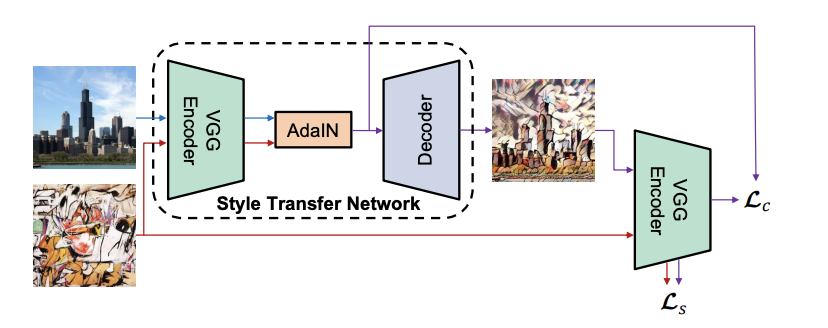
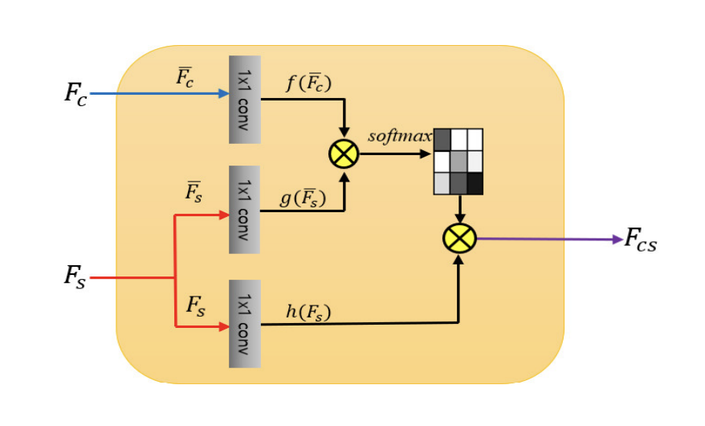
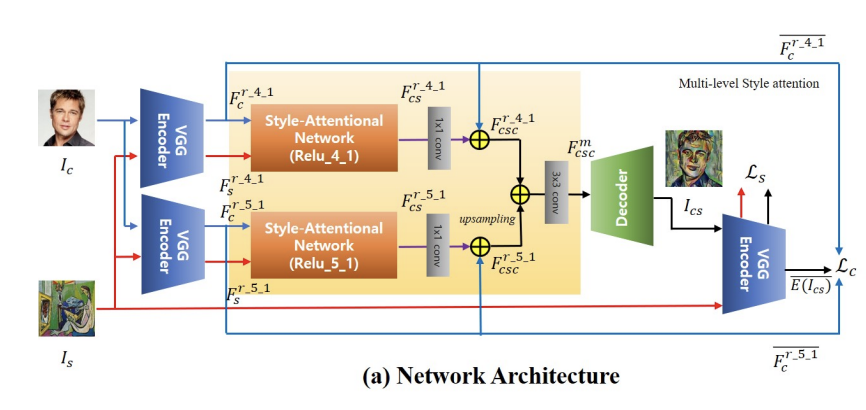
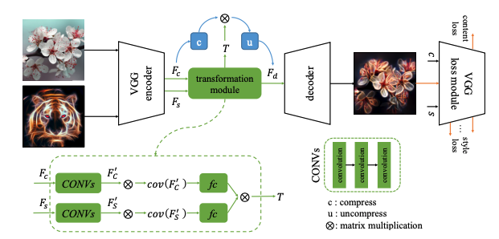
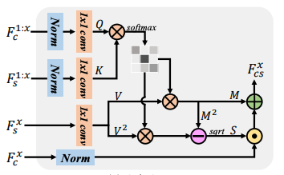
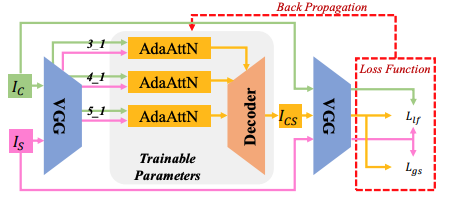
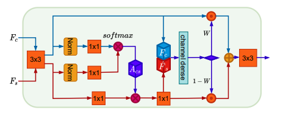
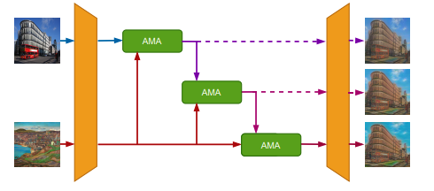
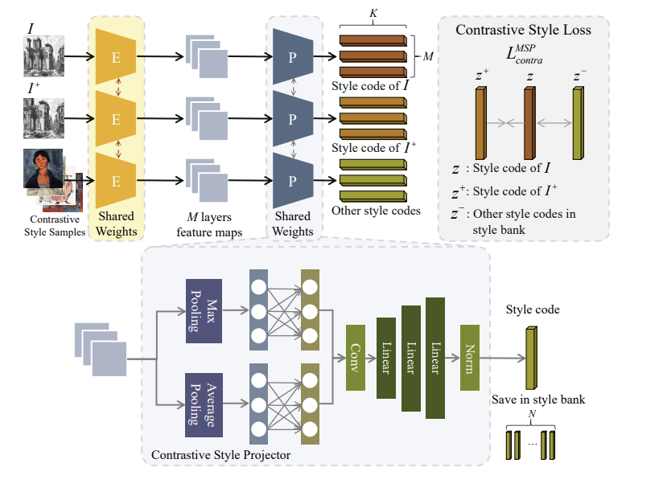
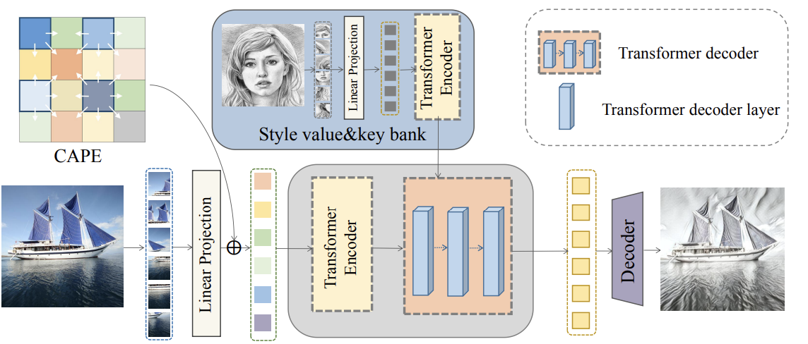

# Related literature review

Arbitrary style transfer aims to generate an art creation that retains the content's structure of user photo while incorporating the style of another image to it. It attracts widespread attention due to interesting results in academic and art perspectives. Prior methods used before exploring deep neural networks (DNNs) often failed to capture semantic structures. The use of DNNs in this task started from discovery that the correlation between features extracted from a pre-trained networks can successfully represent style patterns. Several ideas were previously proposed but they all suffered from lack of arbitrary transfer option, high computational cost or over-simplified nature on the contrary. We will explore several DNN-bases methods in this review.  

### [Arbitrary Style Transfer in Real-time with Adaptive Instance Normalization](https://arxiv.org/abs/1703.06868)

The proposed method uses deep neural networks and second-order statistics which previously showed success in encoding style and content information. It also introduces an Adaptive Instance Normalization layer to match the mean and variance of the content and style inputs which makes it possible to work with arbitrary style using a feed-forward neural network.

Prior research showed that adding instance normalization layer significantly improves feed-forward stylization and texture synthesis. The authors of this article explored the reasons behind it. They concluded that instance normalization layer works as a form of style normalization by normalizing feature statistics. Relying on that observation, they proposed ADAptive Instance Normalization (AdaIN) layer that takes a content and style input and aligns the channel-wise mean and variance of the former to match those of the latter. It does this by normalizing the content, multiplying it by the variance and adding the mean of the style features

$$
\text{AdaIN}(x, y) = \sigma(y)\left(\frac{x-\mu(x)}{\sigma(x)} \right) + \mu(y).
$$

The proposed neural network architecture is based on an encoder-decoder structure where encoder is fixed to the initial layers of a pre-trained VGG-19. The network takes a content and an arbitrary style images, encodes them in feature space and feeds extracted feature maps to the AdaIN layer to align their mean and variance. The resulting feature maps are used to generate the target image with the decoder that mostly mirrors encoder architecture.

*network architecture*

The decoder is firstly randomly initialized and then trained using a combination of content and style losses where the content loss is calculated as the Euclidean distance between the AdaIN modified features used to feed the generator and the features of the generated image and the style loss is the sum of the Euclidean distances between the means and variances of the features extracted from the style image and the generated image on various pre-trained VGG-19 layers:

$$
L_s = \sum_{i=1}^L\Vert\mu(\phi_i(g)) - \mu(\phi_i(s))\Vert_2 + \Vert\sigma(\phi_i(g)) - \sigma(\phi_i(s))\Vert_2 \ ,
$$

where $g$ and $s$ refer to generated and style images and each $\phi_i$ denotes a VGG-19 layer

The comparison of the obtained results with previous methods shows a slight increase in both content and style loss. However, the style transfer speed has improved dramatically so that it enables the processing of arbitrary user-uploaded styles in real-time.  

### [Arbitrary Style Transfer with Style-Attentional Networks](https://arxiv.org/abs/1812.02342)

This paper introduces an idea of style-attentional network (SANet) using attention-based module that incorporates new identity function in addition to the rest for training.

The main contribution was made by proposing style-attentional module that resembles NLP self-attention module and maps the correspondences between the content and style feature maps. Both feature maps are normalized and transformed using different trainable 1x1 convolutions to calculate the attention between them.

*SANet module*

Network uses two parallel SANet modules that process feature maps extracted by two different pretrained VGG-19 encoder layers. Modules’ outputs are then transformed with 1x1 convolutions, both summed with corresponding content features and combined using upsampled smaller features to be fed into decoder that mostly mirrors VGG encoder.

Loss used to train SANet modules and decoder is a weighted sum of content, style and identity loss. Content loss is the Euclidean distance between the mean–variance channel-wise normalized features of input content image and the generated output image:

$$
L_c = \sum_{i=1}^2\Vert\phi_i(I_{cs}) - \phi_i(I_c)\Vert_2 ,
$$

where $I_{cs}$ and $I_c$ refer to generated and content images and each $\phi_i$ denotes a VGG-19 layer used in feature extraction before attention modules. The style loss is the sum of the Euclidean distances between the means and variances of the features extracted from the style image and the generated image on various pre-trained VGG-19 layers:

$$
L_s = \sum_{i=1}^L\Vert\mu(\phi_i(I_{cs})) - \mu(\phi_i(I_s))\Vert_2 + \Vert\sigma(\phi_i(I_{cs})) - \sigma(\phi_i(I_s))\Vert_2 \ ,
$$

where $I_s$ refers to style image. Identity loss function is proposed as

$$
L_\text{identity} = \\
\lambda_1 (\|I_{cc} - I_c\|_2 + \|I_{ss} - I_s\|_2  )
+ 

\\ \lambda_2 \sum_{i=1}^L (\|\phi_i(I_{cc}) - \phi_i(I_c)\|_2 + \|\phi_i(I_{ss}) - \phi_i(I_s)\|_2  ),

$$

where $I_{cc}$ and $I_{ss}$ denotes the output image synthesized from two same content and style images respectively.

Qualitative comparison shows that SANet model can better parse diverse style patterns such as global color distribution, texture, and local style patterns while maintaining the structure of the content in most examples compared to previous studies. It also better transfers similar style patterns onto the regions with the same semantic meaning.  

### **[Learning Linear Transformations for Fast Arbitrary Style Transfer](https://arxiv.org/abs/1808.04537)**

This paper proposes an arbitrary style transfer approach that is based on learning transformation matrix in feed-forward networks.

Designed model is based on VGG encoder and mirroring decoder that are fixed after being both trained to reconstruct any input image faithfully. Both content and style images are fed into encoder resulting into two corresponding feature maps. Content features that are “compressed” by pair of convolutional layers are then transformed using transformation matrix — a result of transformation module, and “uncompressed” the same way to be fed into decoder to generate target image.

Transformation module gets content and style features as an input, applies several convolutions on them independently, uses fully connected layer above covariance matrixes for both of resulting feature maps and multiplies them to get a transformation matrix. Authors theoretically show that transformation matrix is only conditioned on the content and style images and their terms are independent. According to that, proposed transformation module uses two independent CNNs for the content and style inputs to isolate their interaction and make the structure more suitable.

*network architecture*

Transformation module is trained using weighted sum of content and style losses where the style loss is computed combining the squared Frobenius norm of the difference between the Gram matrices at different layers. The content loss is the Frobenius norm between content features and transferred features. Features are extracted using pre-trained VGG-19.

Qualitative results in artistic style transfer show that the proposed algorithm generates appealing results and performs favorably against methods that were the state-of-the-art at that point. Linear transformation also results in preserving affinity during style transfer that is crucial for video generation. That is why proposed method can also be used in video style transfer.  

### **[AdaAttN: Revisit Attention Mechanism in Arbitrary Neural Style Transfer](https://arxiv.org/abs/2108.03647)**

This paper contributes by presenting AdaAttN module that differs from comparable SANet where only local stylization is performed. AdaAttN gets several inputs: $F^{x}_{c}$ and $F^{x}_{s}$ stand for content and style extracted features of layer $x$ in VGG, $F^{1:x}_{c}$ and $F^{1:x}_{s}$ are features extracted from all layers from 1 to $x$ that where downsampled to the smallest shape and concatenated all together into one feature map for content and style images respectfully.

*AdaAttN module*

The module, firstly, computes attention map $A$  with content and style features from shallow to deep layers $F^{1:x}_{c}$ and $F^{1:x}_{s}$:

$$
Q = \text{conv}_{1\times 1}^q(\text{Norm}(F_{c}^{1:x})), \\
K = \text{conv}_{1\times 1}^k(\text{Norm}(F_{s}^{1:x})), \\
A = \text{Softmax}(Q^T \times K).\\
$$

Secondly, calculates attention-weighted mean and standard variance of style features:

$$
V = \text{conv}_{1\times 1}^v(F_s^x), \\
M = V\times A^T, \\
S = \sqrt{(V\cdot V)\times A^T - M \cdot M}, \\
$$

and finally adaptively normalizes content features using resulting mean and variance:

$$
F_{cs}^x = S\cdot \text{Norm}(F_c^x)+M,
$$

where $\times$ stands for matrix multiplication and $\cdot$  denotes element-wise product.

Three of those AdaAttN modules are integrated into proposed model in the middle of encoder-decoder, each of them uses different $x$ value as a number of the deepest used layer to employ a multi-level strategy.

*network architecture*

Weighted sum of global style loss and local feature loss is used to train both AdaAttN modules and VGG decoder. Global style loss stands for distances of mean and standard deviation between generated image and style image in VGG feature space

$$
L_{gs} = \sum_{x=2}^5 (\|\mu(E^x(I_{cs})) - \mu(F^x_{s}) \|_2 + \|\sigma(E^x(I_{cs})) - \sigma (F^x_{s}) \|_2 )
$$

where $E(*)$ denotes feature of the VGG encoder and its superscript $x$ denotes the layer index. Local feature loss is computed using AdaAttN* — parameter-free version of AdaAttN without learnable convolutions kernels, which helps to generate better stylized output for local areas

$$
L_{ls} = \sum_{x=3}^5 \VertE^x(I_{cs}) - \text{AdaAttN}^*(F_c^x, F_s^x, F^{1:x}_c, F^{1:x}_s) \Vert
$$

Image generation results shown in paper are quite convincing and stand out from other methods due to better preserving of content details and less local style attributes.  

### **[Consistent Style Transfer](https://arxiv.org/abs/2201.02233)**

Prior works and attention-based methods ignored feature manifold distribution where each feature manifold corresponds to a semantic region in the image. This resulted in generated images where content semantic regions were rendered by highly different patterns from various style semantic regions producing inconsistent stylization results with visual artifacts. The papers proposes progressive attentional manifold alignment (PAMA) to mitigate this issue using attention operations and space-aware interpolations.

*attentional manifold alignment (AMA) block*

The introduced attentional manifold alignment (AMA) block consists of attention module where content and style features are firstly normalized, fed to 1x1 convolution blocks and then used in computing the attention map that serves an affine transformation to spatially rearrange the style features:

$$
A_{cs}=\text{Softmax}
(

f(\text{Norm}(F_c))^T

\otimes 

g(\text{Norm}(F_s)

), \\

\hat{F}_s =
\theta(

h(\text{Norm}(F_s))^T

\otimes  

A_{cs}

),
$$

where $F_c$ and $F_s$ stands for content and style feature embeddings, $\otimes$  denotes matrix multiplication and $f(\cdot)$, $g(\cdot)$, $h(\cdot)$, $\theta(\cdot)$ stand for 1x1 convolution for feature embeddings. Then goes space-aware interpolation module that adaptively interpolates between content features and rearranged style features by applying convolution kernels of different scale on concatenated features resulting in matrix of weights used in producing final embedding:

$$
W = \frac1n \sum_{i=1}^n \psi([F_c, F_s]), \\
F_{cs} = W\odot F_c + (1-W)\odot  \hat F_s,
$$

where $\odot$ denotes the dot production.

Three of those AMA blocks are stacked between pre-trained VGG encoder and trainable decoder to gradually fuse style information into content features.

*network architecture*

Model is trained using several losses. Image reconstruction loss minimises the difference between original content and style images and the ones that were reconstructed from corresponding VGG features:

$$
L_{\text{rec}} = \lambda (\|I_{rc}-I_c\|_2 + \|I_{rs}-I_s\|_2 ) +  \sum_{i}(\|\phi_i(I_{rc})-\phi_i(I_c)\|_2 + \|\phi_i(I_{rs})-\phi_i(I_s)\|_2 ),

$$

where $I_{c}$ and $I_s$ are original content and style images,  $I_{rc}$ and $I_{rs}$ are reconstructed content and style images and $\phi_i$ stands for $i$-th layer VGG feature.

To align manifolds gradually and progressively the overall loss function consists of multiple stages where each stage has its own weights for content self-similarity $L_{ss}$ losse and style $L_r$, $L_{m}$ and $L_{h}$ losses:

$$
L=\sum_{i=1}^3 ( \lambda_{ss}^i{L}_{ss} + \lambda_{r}^i{L}_{r}  + \lambda_{m}^i{L}_{m} +\lambda_{h}^i{L}_{h}  ) + {L}_{\text{rec}}.
$$

The initial value of the content loss weight is relatively high to encourage the manifold structure of the rearranged style features to be the same as content features. In the next stages, the content weight decreases gradually to encourage more vivid style patterns while preserving the relationship between manifolds and rendering the features consistently. Content loss:

$$
{L}_{ss}=\frac{1}{H_cW_c}\sum_{i,j}\left|\frac{D_{ij}^c}{\sum_i D_{ij}^c} - \frac{D_{ij}^{cs}}{\sum_i D_{j}^{cs}} \right| ,
$$

where $D_{ij}^c$ and $D_{ij}^{cs}$ are the pairwise cosine distance matrices of $F_c$ and $F_{cs}$ respectively, helps to preserve maniforl structure. The style relaxed earth mover distance loss:

$$
{L}_{r}=\max\left(
\frac{1}{H_sW_s} \sum_i \min_jC_{ij}, \frac{1}{H_cW_c} \sum_j \min_iC_{ij} \right)
,

$$

where $C_{ij}$ denotes the pair-wise cosine distance matrix between $F_{cs}$ and $F_s$, optimizes along the maniforld surface of style features. Another loss is used to regularize the magnitude of the features:

$$
{L}_m=\|\mu_{cs} - \mu_s\|_1+ \|\Sigma_{cs} - \Sigma_s\|_1.
$$

Histogram loss is also included to fix color-mixed images:

$$
{L}_h = \frac1{\sqrt 2}\left\|H_s^{\frac12} - H_{cs}^{\frac12}\right\|_2,
$$

where $H^{\frac12}$ refers to element-wise square root of color histogram feature.

Proposed method achieves a better balance between content and style while increasing the consistency in semantic regions and becomes preferable among users.  

### **[Domain Enhanced Arbitrary Image Style Transfer via Contrastive Learning](https://arxiv.org/abs/2205.09542)**

Previously presented arbitrary style transfer methods were mostly based on second-order statistics such as Gram matrix of content features which can fail in capturing style information. Contrastive learning targets this problem by learning directly from image features focusing in similarities and differences between styles.

Proposed contrastive Arbitrary Style Transfer (CAST) architecture includes multi-layer style projector (MSP) which is trained to project features of artistic image into style code, contrastive style learning module and domain enhancement scheme are both used to guide training.

MSP takes features of different layers of VGG style feature extractor (encoder) and projects them into separate latent style spaces by using max and average poolings, several multilayer perceptrons and convolution layers.

*multi-layer style projector (MSP) architecture*

To manage a contrastive style learning in MSP training, a style image and its augmented version are fed into MPS module as a positive pair to then maximize their mutual information in contrast to other artistic images within the dataset that are considered negative samples:

$$
{L}_{\text{contra}}^{\text{MSP}}=-\sum_{i=1}^M{\log \frac{\exp(z_{i} \cdot {z_{i}^{+}}/ \tau)}{\exp (z_{i} \cdot {z_{i}^{+}} / \tau)+\sum_{j=1}^N{\exp(z_{i} \cdot {z_{i_{j}}^{-}} / \tau)}}} ,
$$

where $\cdot$ denotes the dot product of two vectors, $z$ corresponds to latent vector of an image and $\tau$ is a temperature scaling factor. Latent vectors are normalized before being used in calculation loss to prevent collapsing.

Similar loss is used to guide generator used to transfer style into image but we use latent embeddings of generated and style image as positive pair and negative examples are sampled from the same dictionary used for MSP training.

Style distributions can be learned through including adversarial loss which strongly rely on the distribution of datasets. Two discriminators $D_R$ and $D_A$ are used to work with images in realistic and artistic domain separately. The adversarial loss is:

$$
{L}_{adv} = \mathbb{E}[\log D_R(I_c)]+\mathbb{E}[\log (1-D_R(I_{cs}))]\\ + \mathbb{E}[\log D_A(I_s)]+\mathbb{E}[\log (1-D_A(I_{sc}))],
$$

where $I_c$ and $I_s$ are original content and style images, $I_{cs}$ and $I_{sc}$ are images generated to be artistic and realistic respectively that are used as fake samples. Authors also wanted their model to save content information of the content image after style transfering in both domains so they added cycle consistency loss:

$$
{L}_{cyc} = \mathbb{E} [\| I_c -G(I_{cs},I_c)\|_1] + \mathbb{E} [\| I_s -G(I_{sc},I_s)\|_1].
$$

The full loss used in model training is a weighted sum of all the above. 

Qualitative and user study showed that this method outcomes others in stylization performances confidently introducing both local style features such as distinctive strokes and global style characteristics such as large empty regions found in original style images.  

### **[StyTr2: Image Style Transfer with Transformers](https://arxiv.org/abs/2105.14576)**

CNN-based methods that are mostly used in style transfer task fail to capture long-range dependencies without sufficient layers but staking a lot of convolutions can cause on fine detail loss. Proposed Style Transfer Transformer (StyleTr2) framework eliminates CNN parts in favor of transformer-based encoders and decoders.

StyleTr2 includes two transformer encoders for each of photorealistic and artistic domains to capture long-range dependencies. Both content and style input sequences that are results of linear projection layer, are first fed into multi-head self-attention module and then are headed to two MLP layers with ReLU activation in the middle. Layer normalization is applied after each block. Each content input patch is also summed with content-aware learnable positional encodings (CAPE):

$$
{P}_{L} = \text{conv}_{1\times 1}(\text{AvgPool}_{n \times n}({E})),  \\ {P}_{{CA}}(x,y) = \sum_{k=0}^{s}\sum_{l=0}^{s}(a_{kl}\cdot {P}_{ L}{(x_k,y_l)}),
$$

where $s$ is the number of neighbouring pathces and ${P}_{{CA}i}$ is added to feature embedding $E_i$ of the $i$-th patch at a pixel location $(x, y)$.

Decoder has CNN based architecture and consists of three layers to refine the outputs.

*network architecture*

Several losses are used to train the network. Content perceptual loss tries to minimize distance between VGG features of generated and content images:

$$
L_c = \frac{1}{N_l}\sum_{ i=0 }^{N_L} \| \phi_i(I_{cs}) - \phi_i(I_{c})  \|_2.
$$

Proposed transformer decoder is used to translate the encoded content sequence according to the encoded style sequence in a regressive fashion taking all the sequential patches as input. It consists of two multi-head attention layers with layer normalization and a feed-forward module used in encoder.

where $\phi_i$ denotes $i$-th layer in a pre-trained VGG-19. Style perceptual loss tends to minimize mean and variance of VGG features of generated and style images:

$$
L_c = \frac{1}{N_l}\sum_{ i=0 }^{N_L} \| \mu(\phi_i(I_{cs}))  - \mu(\phi_i(I_{s}))  \|_2 \\+ \| \sigma(\phi_i(I_{cs}))  - \sigma(\phi_i(I_{s}))  \|_2.
$$

Two identity losses help with making more accurate content and style representations:

$$
{L}_{\text{id}_1} = \|I_{cc} - I_c\|_2 + \|I_{ss}+I_s\|_2, \\
{L}_{\text{id}_2} = 
\frac 1{N_l}\sum_{i=0}^{N_l}
\|\phi_i(I_{cc}) - \phi_i(I_c)\|_2 + \|\phi_i(I_{ss})+\phi_i(I_s)\|_2.
$$

Final loss is a weighted sum of the above.

Proposed method results in capturing long-range dependencies of content ans style feature without missing local details. It also doesn’t leak content after repeating several rounds of the same stylization process in contrast with other methods.